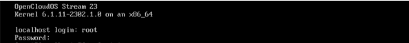
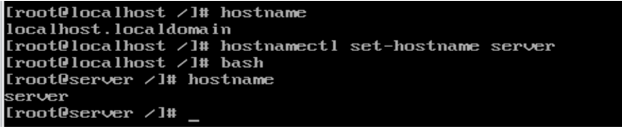
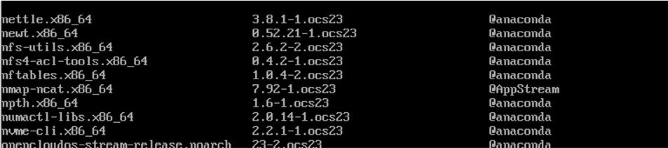
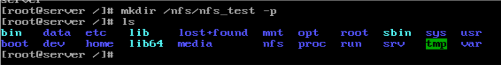
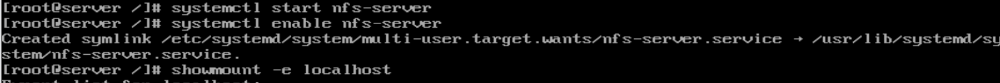
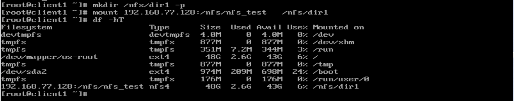
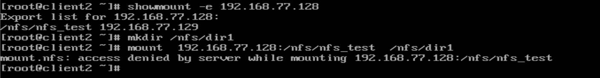

# 部署NFS服务器

### 准备工作

创建三台虚拟机（1服务器+2客户机）

1.安装操作系统：OpenCloudOS Stream

2.root用户登陆系统



3.修改主机名，方便后续实验区分出各个主机

```bash
hostnamectl  set-hostname  server 
```



将服务器主机名修改为 Server，对应的将客户机1主机名修改为Cllient1，客户机2主机名修改为Cllient2

4.查看当前nfs版本


可以看到当前版本为2.6.2.

（OpenCloudOS已经安装了nfs_utils以及相关依赖包rpcbind，不需要再进行yum安装）




5.查看服务器和客户机ip地址。

```bash
ifconfig
```


服务器以及两台客户机的ip地址如下：

服务器:192.168.77.128

客户机1:192.168.77.129

客户机2:192.168.77.130

### 部署NFS服务器以及验证

#### 服务器配置

###### 1.创建共享目录

```bash
mkdir /nfs/nfs_test 
```



###### 2.编辑配置文件

nfs的主要配置文件为/etc/exports，其中列出了共享的目录，允许的用户以及用户选项。

指定用户的方式可以是ip地址、主机名、域名、或者指定某子网中的所有主机等等

用户选项主要分为三种，包括访问权限选项，用户映射选项，其他选项等。如ro、wr为访问权限选项，表示只读，wr表示允许读写。其他各选项具体含义可参考相关文档。

```bash
vim /etc/exports
cat /etc/export
```


编辑配置文件并使用cat命令查看编辑后配置文件内容。这里我们对配置文件的输入为/nfs/nfs_test 192.168.77.129(ro,sync),即将目录/nfs/nfs_test共享，允许访问的用户为192.168.77.129，也就是客户机1，ro代表只读，sync表示将数据同步写入内存缓冲区与磁盘中，效率低，但可以保证数据的一致性。

###### 3.关闭防火墙

```bash
systemctl stop firewalld
systemctl enable firewalld
```


如果不关闭防火墙的话，客户机将会被禁止访问服务器。

###### 4.启动服务器并设置开机自动运行

```bash
systemctl stop firewalld
systemctl enable firewalld
```



###### 5.检查本地资源抛出情况

```bash
showmount -e 192.168.77.128
```


可以看到，/nfs/nfs_test被成功抛出。

#### 客户机验证

###### 1.查看共享目录

```bash
 showmount -e 192.168.77.128
```

在客户机1和客户机2上分别执行，结果如下：

客户端1： 193.168.77.129


客户端2：193.168.77.130


###### 2.挂载到本地目录

```bash
mkdir /nfs/dir1
mount -t   nfs   192.168.77.127:/nfs/nfs_test   /nfs/dir1
```

将主机192.168.77.127的共享目录/nfs/nfs_test挂载到本地目录/nfs/dir1下。

在客户机1和客户机2上分别执行上述命令

客户机1：193.168.77.129



使用df -ht命令可以查看各个文件占用磁盘情况，可以看到挂载成功。

客户机2：193.168.77.130



对于客户机2，由于没有权限被禁止访问。

至此，对于NFS服务器的部署以及验证完成。
